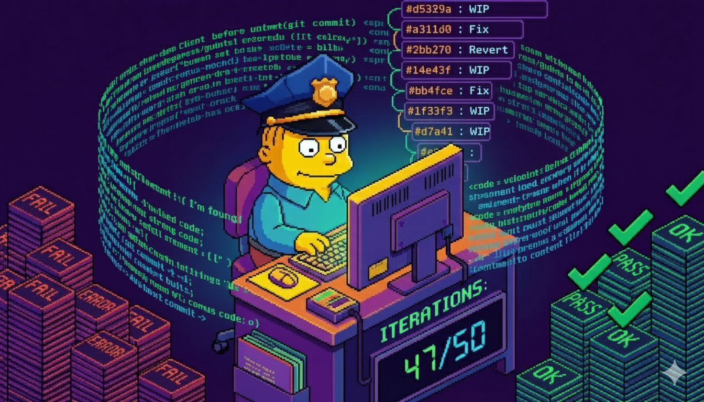

# Chief Wiggum Plugin



A fork of the [ralph-wiggum](https://github.com/anthropics/claude-code/tree/main/plugins/ralph-wiggum) plugin for Claude Code, implementing self-referential AI development loops.

## Why This Fork?

This fork exists for two reasons:

### 1. Bug Fixes

Includes fixes from [PR #12642](https://github.com/anthropics/claude-code/pull/12642) that resolve issues with the original plugin:
- Multi-line bash commands in slash commands were blocked by security checks
- Permission check bug with auto-execute syntax
- Completion promise display logic moved to setup script for reliability

### 2. Natural Language Invocation

You can start a Wiggum loop just by asking Claude naturally:

> "Wiggum this until the tests pass"
> "Keep trying to fix the build"
> "Run in a loop until it works"

The plugin includes a skill file that recognizes these phrases and automatically starts an appropriate loop with sensible defaults.

## What is Ralph Wiggum?

The Ralph Wiggum technique is an iterative development methodology based on continuous AI loops, pioneered by [Geoffrey Huntley](https://ghuntley.com/ralph/).

**Core concept:** Feed Claude the same prompt repeatedly. Each iteration, Claude sees its previous work in files and git history, allowing it to iteratively improve until the task is complete.

This plugin implements Ralph using a **Stop hook** that intercepts Claude's exit attempts and feeds the same prompt back.

## Quick Start

```bash
/wiggum-loop "Build a REST API for todos. Requirements: CRUD operations, input validation, tests. Output <promise>COMPLETE</promise> when done." --completion-promise "COMPLETE" --max-iterations 50
```

Or just ask naturally:

> "Wiggum it - implement user authentication with tests"

## Commands

### /wiggum-loop

Start a loop in your current session.

```bash
/wiggum-loop "<prompt>" --max-iterations <n> --completion-promise "<text>"
```

**Options:**
- `--max-iterations <n>` - Stop after N iterations (default: unlimited)
- `--completion-promise <text>` - Phrase that signals completion

### /cancel-wiggum

Cancel the active loop.

```bash
/cancel-wiggum
```

## Completion Promises

To signal completion, output a `<promise>` tag with the exact text specified:

```
<promise>COMPLETE</promise>
```

The stop hook detects this tag and ends the loop. Without it (or `--max-iterations`), the loop runs indefinitely.

## Best Practices

### Clear Completion Criteria

```markdown
Build a REST API for todos.

When complete:
- All CRUD endpoints working
- Input validation in place
- Tests passing (coverage > 80%)
- Output: <promise>COMPLETE</promise>
```

### Always Set Max Iterations

```bash
/wiggum-loop "Try to implement feature X" --max-iterations 20
```

This prevents infinite loops on impossible tasks.

## When to Use

**Good for:**
- Well-defined tasks with clear success criteria
- Tasks requiring iteration (getting tests to pass)
- Greenfield projects
- Tasks with automatic verification (tests, linters)

**Not good for:**
- Tasks requiring human judgment
- One-shot operations
- Unclear success criteria

## Learn More

- Original technique: https://ghuntley.com/ralph/
- Ralph Orchestrator: https://github.com/mikeyobrien/ralph-orchestrator
